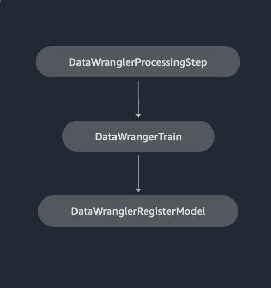

# Integrating SageMaker Data Wrangler with SageMaker Pipelines

[SageMaker Pipelines](https://aws.amazon.com/sagemaker/pipelines/) is a native workflow orchestration tool for building ML pipelines that take advantage of direct Amazon SageMaker integration. Along with SageMaker model registry and SageMaker Projects, pipelines improves the operational resilience and reproducibility of your ML workflows. These workflow automation components enable you to easily scale your ability to build, train, test, and deploy hundreds of models in production, iterate faster, reduce errors due to manual orchestration, and build repeatable mechanisms. Each step in the pipeline can keep track of the lineage, and intermediate steps can be cached for quickly re-running the pipeline. You can create pipelines using the [SageMaker Python SDK](https://sagemaker.readthedocs.io/en/stable/workflows/pipelines/sagemaker.workflow.pipelines.html).

## Architecture Overview

A workflow built with SageMaker pipelines consists of a sequence of steps forming a directed acyclic graph (DAG). In this example, we begin with a Processing step, where we start a SageMaker Processing job based on SageMaker Data Wrangler’s flow file to create a training dataset. We then continue with a Training step, where we train an XGBoost model using SageMaker’s built-in XGBoost algorithm and the training dataset created in the previous step. Once a model has been trained, we end this workflow with a RegisterModel step, where we register the trained model with SageMaker model registry. 

	

		
	

## Installation and walkthrough

To run this sample, we will use a Jupyter notebook running Python3 on a Data Science kernel image in a SageMaker Studio environment. You can also run it on a Jupyter notebook instance locally on your machine by setting up the credentials to assume the SageMaker execution role. The notebook is lightweight and can be run on an `ml.t3.medium` instance.

You can either use the export feature in SageMaker Data Wrangler to generate the Pipelines code, or build your own script from scratch. In our sample repository, we have used a combination of both approaches for simplicity. At a high level, these are the steps to build and execute the SageMaker Pipelines workflow.

### In the setup notebook (<code>00_setup_data_wrangler.ipynb</code>)
1. Generate a flow file from Data Wrangler or use the setup script to generate a flow file from a preconfigured template.
2. Create an Amazon S3 bucket and upload your flow file and input files to the bucket. In our sample notebook, we use SageMaker’s default S3 bucket.

### In the SageMaker Pipelines notebook (<code>01_setup_sagemaker_pipeline.ipynb</code>)
3. Follow the instructions in the <code>01_setup_sagemaker_pipeline.ipynb</code> notebook to create a `Processor` object based on the Data Wrangler flow file, and an `Estimator` object with the parameters of the training job. 
   *  In our example, since we only use SageMaker features and SageMaker’s default S3 bucket, we can use SageMaker Studio’s default execution role. The same IAM role will be assumed by the pipeline run, the processing job and the training job. You can further customize the execution role according to minimum privilege.
4. Continue with the instructions to create a pipeline with steps referencing the `Processor` and `Estimator` objects, and then execute a pipeline run. The processing and training jobs will run on SageMaker managed environments and will take a few minutes to complete. 
5. In SageMaker Studio, you can see the pipeline details monitor the pipeline execution. You can also monitor the underlying processing and training jobs from the Amazon SageMaker Console, and from Amazon CloudWatch.

### Cleaning Up

Follow the instructions under **Part 3: Cleanup** in the SageMaker Pipelines notebook (<code>01_setup_sagemaker_pipeline.ipynb</code>) to delete the Pipeline, the Model and the Experiment created during this sample.