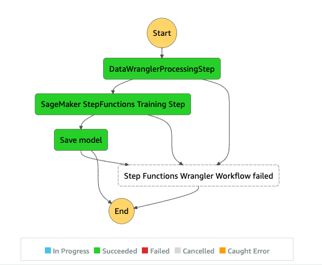

## SageMaker Data Wrangler with AWS Step Functions

## Getting Started

In this sample, we will use Step Functions to orchestrate the data wrangler based ML workflow using [AWS Step Functions Data Science SDK](https://docs.aws.amazon.com/step-functions/latest/dg/concepts-python-sdk.html)
The AWS Step Functions Data Science SDK is an open-source library that allows data scientists to create workflows that can preprocess datasets, build, deploy and monitor machine learning models using AWS SageMaker and AWS Step Functions. The AWS Step Functions Data Science SDK provides a Python API that can create and invoke Step Functions workflows. You can manage and execute these workflows directly in Python, as well as Jupyter notebooks.

We will build a simple ML workflow leveraging SageMaker that has a preprocessing step using Data Wrangler, a training step and a save model step. We will chain these steps in order, assign dependencies and catch failures in the flow with Step Functions. The workflow will look as below

## Instructions 

To run this sample, we used a Jupyter notebook running Python3 on a data science kernel in a SageMaker Studio environment. You can also run it on a Python3 notebook instance locally on your machine by setting up the credentials to assume the SageMaker execution role. The notebook is light weight and can be run on a t3 medium instance for example.

You can either use the export feature in SageMaker Data Wrangler to generate the Pipelines code and modify it for Step functions or build your own script from scratch. In this sample, we have used a combination of both approaches for simplicity. We have taken some pieces from the autogenerated code and extended it with features specific to Step Functions.  

## Executing the notebooks

1. Run the 00_setup_data_wrangler.ipynb notebook step by step. This notebook does the following      
    a. Generates a flow file from Data Wrangler or uses the setup script to generate a flow file from a preconfigured template      
    b. Creates an Amazon S3 bucket and uploads your flow file and input files to the bucket
2. Follow the instructions in the 01_setup_step_functions_pipeline notebook to kick off a Step Functions workflow. 
3. Configure your Amazon SageMaker execution role with the required permissions as mentioned in the 01_setup_step_functions_pipeline notebook 
4. The processing job will be run on a SageMaker managed Spark environment behind the scenes and this can take few minutes to complete
5. Go to StepFunctions console and track the workflow visually thru StepFunctions console. You can also navigate to the linked CloudWatch logs to debug errors.
6. Make sure you clean up all the resources at the end.

## Cleanup 

Please follow the instructions in the cleanup section of the 01_setup_step_functions_pipeline notebook to avoid any additional accumulation of costs. 

