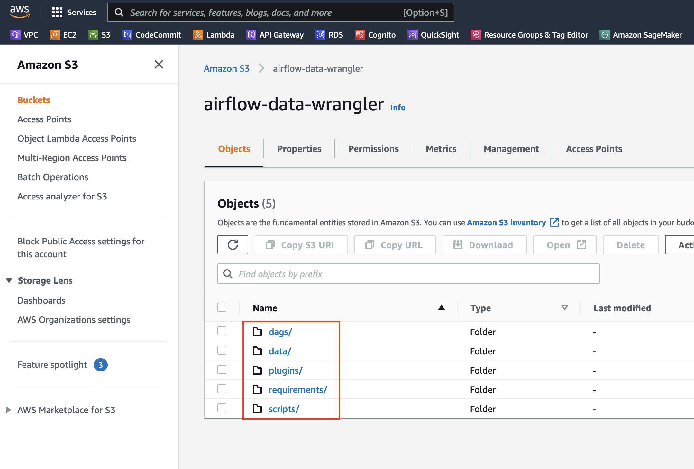
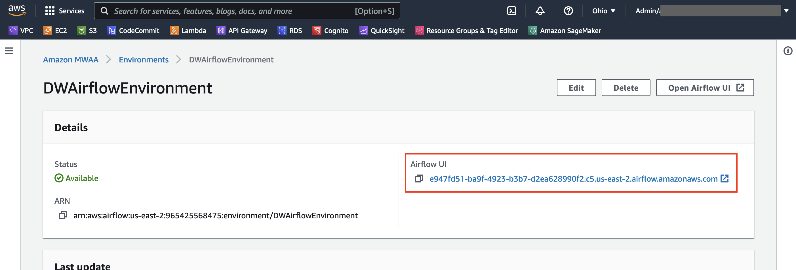
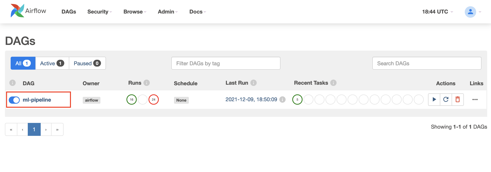
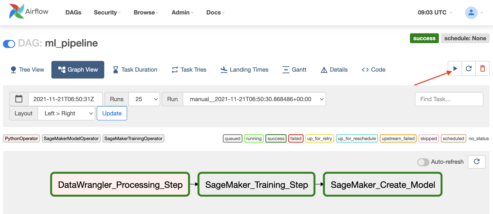
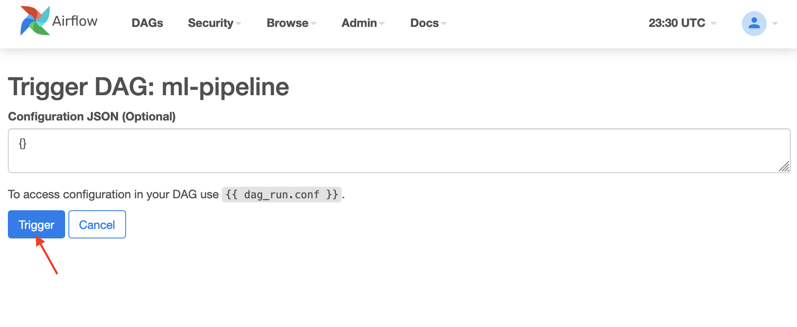
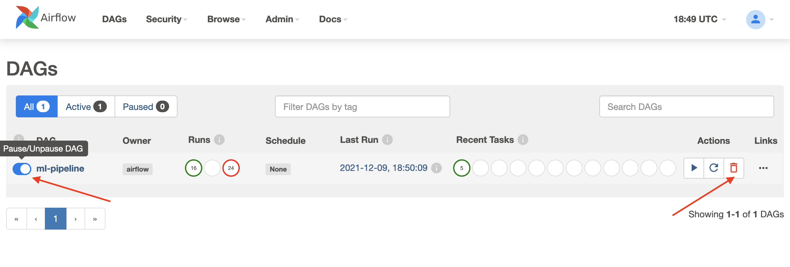
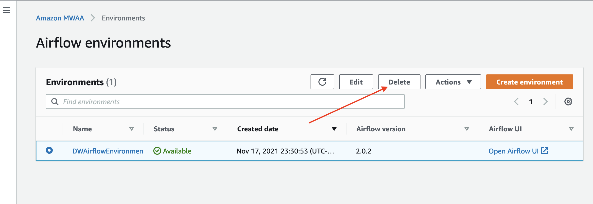

## SageMaker Data Wrangler with Apache Airflow (Amazon MWAA)

### Getting Started

#### Setup Amazon MWAA Environment

1. Create an [Amazon S3 bucket](https://docs.aws.amazon.com/mwaa/latest/userguide/mwaa-s3-bucket.html) and subsequent folders required by Amazon MWAA. The S3 bucket and the folders as seen below. These folders are used by Amazon MWAA to look for dependent Python scripts that is required for the workflow.
   
   <div align="center">
        <p align="center">
            
        </p>
    </div>

2. [Create an Amazon MWAA environment](https://docs.aws.amazon.com/mwaa/latest/userguide/create-environment.html). Note that we used Airflow version 2.0.2 (current latest version supported by Amazon MWAA) for this solution.

#### Setup the Workflow DAG for Apache Airflow

1. Clone this repository to your local machine
   ```
   git clone <repo_url>
   cd data-wrangler-mlops/3-apache-airflow-pipelines
   ```
3. Upload the `requirements.txt` file in the `/scripts` folder. This contains all the Python dependencies required by the Airflow tasks and upload it to the `/requirements` directory within Amazon MWAA primary S3 bucket (created in step 1). This will be used by the managed Airflow environment to install the Python dependencies.
3. Upload the `SMDataWranglerOperator.py` from the `/scripts` folder to the S3 `/dags` directory. This Python script contains code for the custom Airflow operator for SageMaker Data Wrangler. This operator can be used for tasks to process any `.flow` file.
4. Upload the `config.py` script from the `/scripts` folder to the S3 `/dags` directory. This Python script will be used for the first step of our DAG to create configuration objects required by the remaining steps of the workflow.
5. Finally, upload the `ml_pipelines.py` file from the `/scripts` folder to the S3 `/dags` directory. This script contains the DAG definition for the Airflow workflow. This is where we define each of the tasks, and setup dependencies between them. Amazon MWAA will periodically poll the /dags directory to execute this script to create the DAG or update the existing one with any latest changes.

#### Run the Airflow workflow DAG

1. Navigate to the Amazon MWAA console and find your Airflow environment.
2. Click on the Environment name to see the details, then click the link under "Airflow UI" to open the Airflow Admin UI in a new browser tab.
   
   <div align="center">
        <p align="center">
            
        </p>
    </div>

3. In the Airflow UI, click the DAG named `ml-pipeline` to see the details of the DAG. If you don't see the DAG then wait for a few moments for the DAG to get created. Amazon MWAA will poll the S3 bucket periodically and read the Python scripts from the bucket and will execute them to setup the DAG.
   
   <div align="center">
        <p align="center">
            
        </p>
    </div>

4. Click on the "Graph View" tab to view the DAG and then click the play button on the top right of the screen to start the workflow execution. This is the manual way to start the workflow execution, however, this can be automated using Apache Airflow Sensors and Plugins. Refer to the [documentation](https://docs.aws.amazon.com/mwaa/latest/userguide/configuring-dag-import-plugins.html) for more information on how to setup sensors.
   
    <div align="center">
        <p align="center">
            
        </p>
    </div>

5. In the next screen keep the "Configuration JSON" as default and click "Trigger". This will start the Workflow execution.

    <div align="center">
        <p align="center">
            
        </p>
    </div>

6. Once the workflow is completed successfully you can check the S3 location (from the AWS console) specified as the DataWrangler output location to see the transformed output files generated. Verify that the model was created from the SageMaker Console.

7. (Otional) You can look at the Workflow task logs by clicking on a Task in the DAG (in DAG View) and then clicking on the "Logs" button in the pop-up window.


---

### Cleaning Up

1. On the Airflow UI, click the "DAGs" button on the top of the page to show the list of DAGs.
2. Click the Switch right next the DAG's name to turn it off (_"Pause DAG"_) and then click on the Delete (trash can) button on the right to delete the DAG.
   
   <div align="center">
        <p align="center">
            
        </p>
    </div>

3. Close the Airflow UI screen and navigate to the Amazon MWAA Console from AWS console to view the list of MWAA environments. Select the MWAA environment and click Delete.

    <div align="center">
        <p align="center">
            
        </p>
    </div>

4. Delete the Amazon S3 bucket for MWAA that you created at the beginning of this tutorial and all the folders and files within it. Refer to the Amazon MWAA [documentation](https://docs.aws.amazon.com/mwaa/latest/userguide/working-dags-delete.html#working-dags-s3-dag-delete) on how to delete just the DAG files from S3.