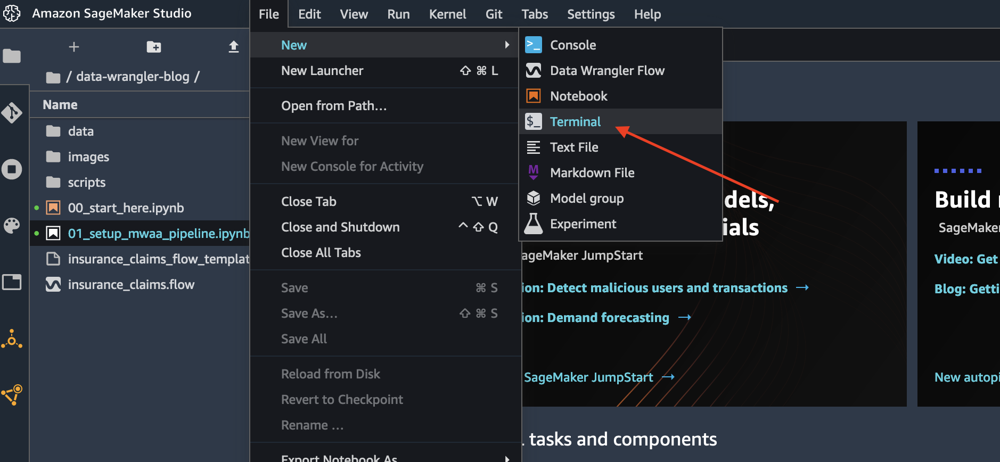

# Integrate SageMaker Data Wrangler into your MLOps workflows

[](https://github.com/aws-samples/sm-data-wrangler-mlops-workflows/releases)
[](https://github.com/aws-samples/sm-data-wrangler-mlops-workflows/blob/main/LICENSE)


<div align="center">
    <p align="center">
        
    </p>
</div>

## Get Started

1. Setup an [Amazon SageMaker Studio domain](https://docs.aws.amazon.com/sagemaker/latest/dg/gs-studio-onboard.html).
2. Log-on to Amazon SageMaker Studio. Open a terminal from _File_ menu > _New_ > _Terminal_
   
   <div align="center">
    <p align="center">
    
    </p>
    </div>

3. Clone this repository

```sh
git clone https://github.com/aws-samples/sm-data-wrangler-mlops-workflows.git data-wrangler-pipelines
```

4. Open the [00_setup_data_wrangler.ipynb](./00_setup_data_wrangler.ipynb) file and follow instructions in the notebook

---

## Setup end-to-end MLOps Pipelines

- [Setup Amazon SageMaker Data Wrangler with SageMaker Pipelines](./1-sagemaker-pipelines/README.md)
- [Setup Amazon SageMaker Data Wrangler with AWS Step Functions](./2-step-functions-pipelines/README.md)
- [Setup Amazon SageMaker Data Wrangler with Amazon Managed Workflow for Apache Airflow](./3-apache-airflow-pipelines/README.md)

## Security

See [CONTRIBUTING](CONTRIBUTING.md#security-issue-notifications) for more information.

## License

This library is licensed under the MIT-0 License. See the LICENSE file.